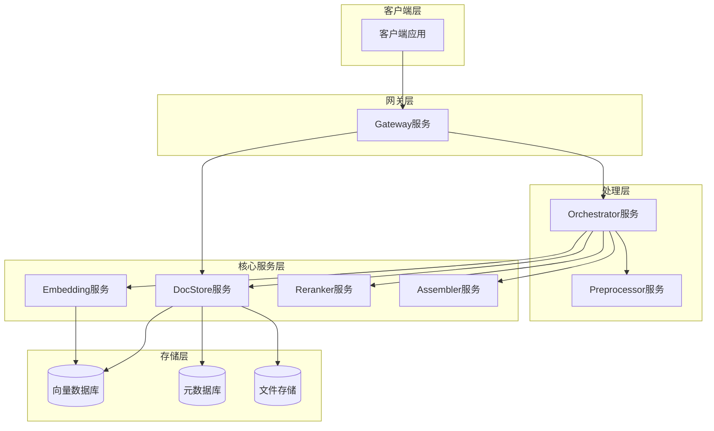
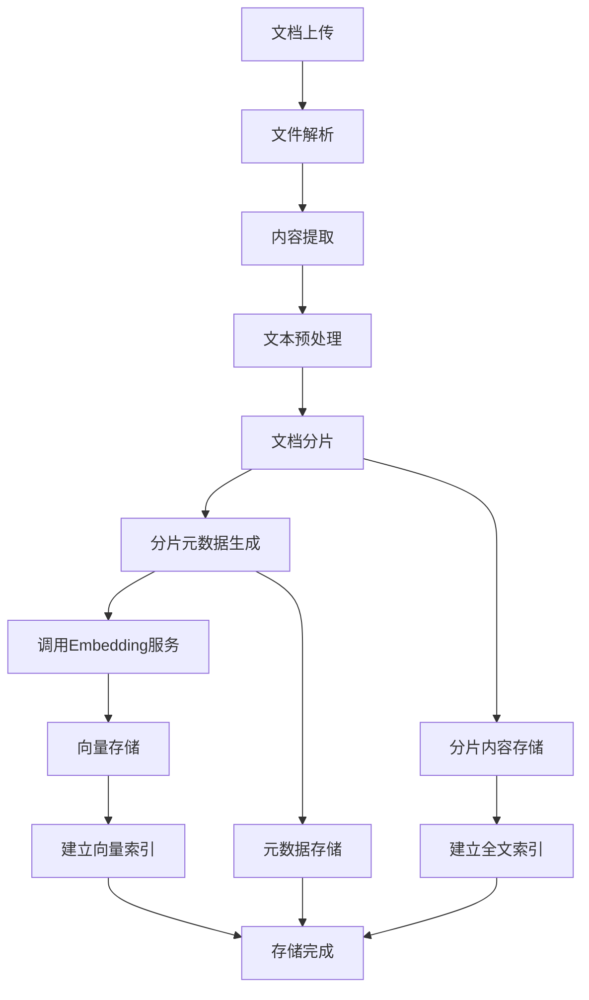
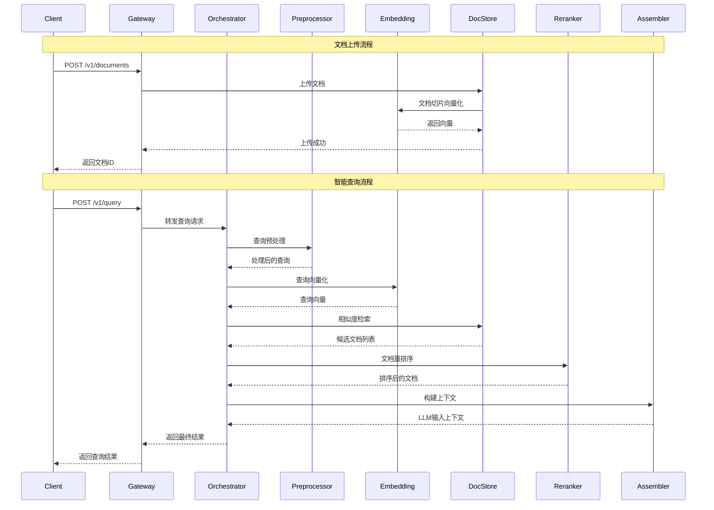

# RAG微服务架构API定义设计

## 概览

本设计定义了基于RAG（检索增强生成）的微服务架构中各个服务的API接口。系统采用Protocol Buffers (proto3)定义服务间通信协议，确保高效、类型安全的服务间调用。

整个系统由7个核心微服务组成，每个服务承担特定的业务职责，通过统一的API协议进行协作，构建完整的智能问答检索增强系统。

## 技术架构

### 服务架构图

### 服务职责矩阵

| 服务 | 主要职责 | 输入 | 输出 | 依赖服务 |
|------|---------|------|------|----------|
| Gateway | 统一入口、鉴权、路由、文档管理API | 用户请求、文档操作 | 路由后的请求、文档操作结果 | DocStore（文档操作） |
| Preprocessor | 查询改写、清洗、扩展 | 原始查询 | 处理后的查询 | 无 |
| Embedding | 文本向量化 | 文本内容 | 向量表示 | 无 |
| DocStore | 文档管理、向量存储 | 文档、查询向量 | 文档片段、相似度结果 | Embedding |
| Reranker | 文档精排 | 文档集合、查询 | 重排序后的文档 | 无 |
| Assembler | 上下文拼接、Token管理 | 文档片段、查询 | LLM输入上下文 | 无 |
| Orchestrator | 服务编排、流程控制 | 用户查询 | 最终响应 | 所有服务 |

## API接口定义

### Gateway服务API

Gateway服务作为系统统一入口，负责用户认证、请求路由和访问控制。

#### 接口规范

| 方法 | 路径 | 描述 | 认证要求 |
|------|------|------|----------|
| POST | /v1/auth/login | 用户登录 | 无 |
| POST | /v1/auth/refresh | 刷新令牌 | Bearer Token |
| POST | /v1/query | 智能问答查询 | Bearer Token |
| POST | /v1/documents | 文档上传 | Bearer Token |
| GET | /v1/documents/{document_id} | 获取文档详情 | Bearer Token |
| DELETE | /v1/documents/{document_id} | 删除文档 | Bearer Token |
| GET | /v1/documents | 获取文档列表 | Bearer Token |
| PUT | /v1/documents/{document_id}/metadata | 更新文档元数据 | Bearer Token |
| GET | /v1/health | 健康检查 | 无 |

#### 消息定义

**认证相关消息**
- LoginRequest: 包含用户名和密码
- LoginResponse: 返回访问令牌和刷新令牌
- RefreshTokenRequest: 包含刷新令牌
- RefreshTokenResponse: 返回新的访问令牌

**查询相关消息**
- QueryRequest: 包含用户查询内容、可选的会话ID和查询参数
- QueryResponse: 返回查询结果、相关文档和元数据信息

**文档管理消息**
- UploadDocumentRequest: 包含文档文件、标题、元数据和文档类型
- UploadDocumentResponse: 返回文档ID、上传状态和处理进度
- GetDocumentRequest: 包含文档ID和可选的字段筛选
- GetDocumentResponse: 返回文档完整信息和元数据
- DeleteDocumentRequest: 包含文档ID和删除选项
- DeleteDocumentResponse: 返回删除状态和清理信息
- ListDocumentsRequest: 包含分页参数、筛选条件和排序选项
- ListDocumentsResponse: 返回文档列表、总数和分页信息
- UpdateDocumentMetadataRequest: 包含文档ID和更新的元数据
- UpdateDocumentMetadataResponse: 返回更新状态和新的元数据版本

### Preprocessor服务API

Preprocessor服务负责查询预处理，包括文本清洗、查询改写和同义词扩展。

#### 接口规范

| 方法 | 描述 | 输入类型 | 输出类型 |
|------|------|----------|----------|
| ProcessQuery | 查询预处理 | ProcessQueryRequest | ProcessQueryResponse |
| RewriteQuery | 查询改写 | RewriteQueryRequest | RewriteQueryResponse |
| ExpandSynonyms | 同义词扩展 | ExpandSynonymsRequest | ExpandSynonymsResponse |

#### 处理策略

**文本清洗策略**
- 去除特殊字符和无意义符号
- 标准化空白字符和换行符
- 处理编码问题和乱码

**查询改写策略**
- 语法错误修正
- 口语化表达转换为书面语
- 歧义消解和上下文补全

**同义词扩展策略**
- 基于词典的同义词匹配
- 语义相似词扩展
- 领域特定术语映射

### Embedding服务API

Embedding服务提供文本向量化能力，支持多种向量化模型和批量处理。

#### 接口规范

| 方法 | 描述 | 输入类型 | 输出类型 |
|------|------|----------|----------|
| EmbedText | 文本向量化 | EmbedTextRequest | EmbedTextResponse |
| EmbedBatch | 批量向量化 | EmbedBatchRequest | EmbedBatchResponse |
| GetModelInfo | 获取模型信息 | GetModelInfoRequest | GetModelInfoResponse |

#### 消息定义

**向量化请求消息**
- EmbedTextRequest: 包含文本内容、模型名称和可选参数
- EmbedTextResponse: 返回向量表示和维度信息
- EmbedBatchRequest: 包含文本列表和批处理参数
- EmbedBatchResponse: 返回向量列表和处理状态

**模型信息消息**
- ModelInfo: 包含模型名称、版本、维度和支持的语言
- GetModelInfoResponse: 返回可用的模型列表

### DocStore服务API

DocStore服务管理文档的完整生命周期，包括上传、存储、检索和元数据管理。**所有文档分片信息都存储在DocStore服务中**，包括分片内容、向量数据、位置信息和元数据。

#### 接口规范

| 方法 | 描述 | 输入类型 | 输出类型 |
|------|------|----------|----------|
| UploadDocument | 文档上传和分片 | UploadDocumentRequest | UploadDocumentResponse |
| SearchSimilar | 相似度检索 | SearchSimilarRequest | SearchSimilarResponse |
| GetDocument | 获取文档 | GetDocumentRequest | GetDocumentResponse |
| GetDocumentChunks | 获取文档分片 | GetDocumentChunksRequest | GetDocumentChunksResponse |
| DeleteDocument | 删除文档 | DeleteDocumentRequest | DeleteDocumentResponse |
| UpdateMetadata | 更新元数据 | UpdateMetadataRequest | UpdateMetadataResponse |
| GetChunksByIds | 根据ID获取分片 | GetChunksByIdsRequest | GetChunksByIdsResponse |

#### 数据模型

**文档模型**
| 字段 | 类型 | 描述 | 必填 |
|------|------|------|------|
| document_id | string | 文档唯一标识 | 是 |
| title | string | 文档标题 | 是 |
| content | string | 文档内容 | 是 |
| file_type | string | 文件类型（pdf, docx, txt等） | 是 |
| file_size | int64 | 文件大小（字节） | 是 |
| chunk_strategy | string | 分片策略（段落、固定长度等） | 否 |
| chunk_size | int32 | 分片大小 | 否 |
| chunk_overlap | int32 | 分片重叠大小 | 否 |
| total_chunks | int32 | 总分片数量 | 是 |
| metadata | map<string, string> | 文档元数据 | 否 |
| created_at | timestamp | 创建时间 | 是 |
| updated_at | timestamp | 更新时间 | 是 |

**文档片段模型**
| 字段 | 类型 | 描述 | 必填 |
|------|------|------|------|
| chunk_id | string | 片段唯一标识 | 是 |
| document_id | string | 所属文档ID | 是 |
| content | string | 片段内容 | 是 |
| start_position | int32 | 在文档中的起始位置 | 是 |
| end_position | int32 | 在文档中的结束位置 | 是 |
| embedding | repeated float | 向量表示 | 否 |
| chunk_index | int32 | 片段在文档中的顺序索引 | 是 |
| chunk_type | string | 片段类型（段落、句子、表格等） | 否 |
| token_count | int32 | 片段包含的token数量 | 否 |
| created_at | timestamp | 创建时间 | 是 |
| updated_at | timestamp | 更新时间 | 是 |

#### 文档分片存储策略

**存储架构**

DocStore服务采用混合存储架构，分别存储不同类型的数据：

| 数据类型 | 存储介质 | 存储内容 | 索引类型 |
|----------|---------|----------|----------|
| 文档元数据 | 关系型数据库 | 文档基本信息、分片统计 | B+树索引 |
| 文档分片内容 | 文档数据库 | 分片文本、位置信息 | 全文索引 |
| 向量数据 | 向量数据库 | 分片向量表示 | 向量索引（HNSW） |
| 原始文件 | 对象存储 | 上传的原始文件 | 文件路径索引 |

**分片处理流程**

**分片策略配置**

| 分片类型 | 适用场景 | 默认参数 | 配置选项 |
|----------|---------|----------|----------|
| 固定长度分片 | 通用文本处理 | 512 tokens, 50 overlap | chunk_size, chunk_overlap |
| 段落分片 | 结构化文档 | 按段落边界 | paragraph_threshold |
| 句子分片 | 精细化检索 | 按句号分割 | sentence_boundary |
| 语义分片 | 高质量检索 | 基于语义相似度 | similarity_threshold |
| 混合分片 | 复杂文档 | 多级分片结合 | multi_level_config |

### Reranker服务API

Reranker服务对初步检索的文档进行精确排序，提高检索结果的准确性。

#### 接口规范

| 方法 | 描述 | 输入类型 | 输出类型 |
|------|------|----------|----------|
| RerankDocuments | 文档重排序 | RerankDocumentsRequest | RerankDocumentsResponse |
| ScoreRelevance | 相关性评分 | ScoreRelevanceRequest | ScoreRelevanceResponse |
| ConfigureModel | 配置排序模型 | ConfigureModelRequest | ConfigureModelResponse |

#### 重排序策略

**评分维度**
- 语义相关性：基于深度语义理解的相关性评分
- 内容质量：文档的完整性、准确性和权威性评估
- 时效性：文档的新鲜度和时间敏感性
- 用户偏好：基于用户历史行为的个性化评分

**算法支持**
- 交叉编码器模型
- 学习排序算法
- 多特征融合排序
- 基于规则的后处理

### Assembler服务API

Assembler服务负责构建适合LLM输入的上下文，管理Token限制和内容拼接策略。

#### 接口规范

| 方法 | 描述 | 输入类型 | 输出类型 |
|------|------|----------|----------|
| AssembleContext | 构建上下文 | AssembleContextRequest | AssembleContextResponse |
| EstimateTokens | 估算Token数量 | EstimateTokensRequest | EstimateTokensResponse |
| OptimizeContent | 内容优化 | OptimizeContentRequest | OptimizeContentResponse |

#### 上下文构建策略

**内容选择策略**
- 基于相关性得分的内容筛选
- 多样性保证的内容去重
- 长度限制下的最优选择

**拼接策略**
- 逻辑顺序排列：按照相关性和逻辑关系排序
- 上下文标记：添加文档来源和分段标识
- 格式化处理：统一格式和样式规范

### Orchestrator服务API

Orchestrator服务协调各个微服务的调用，实现复杂的业务流程编排。

#### 接口规范

| 方法 | 描述 | 输入类型 | 输出类型 |
|------|------|----------|----------|
| ProcessQuery | 处理查询请求 | ProcessQueryRequest | ProcessQueryResponse |
| ExecuteWorkflow | 执行工作流 | ExecuteWorkflowRequest | ExecuteWorkflowResponse |
| GetWorkflowStatus | 获取工作流状态 | GetWorkflowStatusRequest | GetWorkflowStatusResponse |

#### 工作流编排

## 服务间通信协议

### 通信模式

**同步调用**
- 用于实时性要求高的核心查询流程
- 使用gRPC协议确保高性能和类型安全
- 支持超时控制和熔断机制

**异步调用**
- 用于文档上传和批量处理任务
- 支持消息队列和事件驱动架构
- 提供任务状态跟踪和进度查询

### 错误处理策略

**错误分类**
| 错误类型 | 错误码范围 | 处理策略 | 重试机制 |
|----------|------------|----------|----------|
| 客户端错误 | 400-499 | 立即返回，提供详细错误信息 | 不重试 |
| 服务端错误 | 500-599 | 记录日志，返回通用错误信息 | 指数退避重试 |
| 网络错误 | 网络超时 | 自动重试，降级处理 | 固定间隔重试 |
| 业务逻辑错误 | 自定义 | 业务特定处理 | 根据业务规则 |

**降级策略**
- 缓存机制：利用历史查询结果提供近似答案
- 简化流程：跳过非关键步骤，提供基础功能
- 默认响应：在服务不可用时提供预设回复

### 数据一致性

**一致性要求**
- 强一致性：用户认证和权限信息
- 最终一致性：文档内容和向量索引
- 弱一致性：用户行为日志和统计信息

**同步机制**
- 分布式事务：关键业务操作使用两阶段提交
- 事件溯源：记录所有状态变更事件
- 补偿机制：提供回滚和数据修复能力

## 安全与认证

### 认证授权机制

**JWT令牌结构**
- Header：包含算法和令牌类型
- Payload：包含用户信息、权限和过期时间
- Signature：使用密钥签名确保令牌完整性

**权限控制模型**
- 基于角色的访问控制（RBAC）
- 细粒度的API权限管理
- 资源级别的访问控制

### 数据安全

**传输安全**
- 全链路TLS加密
- 证书双向验证
- 敏感数据脱敏传输

**存储安全**
- 数据库加密存储
- 密钥轮换机制
- 访问审计日志

## 测试策略

### 单元测试

**服务级别测试**
- 每个gRPC服务方法的独立测试
- Mock外部依赖的集成测试
- 错误场景和边界条件测试

**组件级别测试**
- 业务逻辑组件的功能测试
- 数据访问层的CRUD操作测试
- 缓存和配置管理的测试

### 集成测试

**服务间集成测试**
- 端到端的业务流程测试
- 服务依赖关系验证
- 数据一致性检查

**性能测试**
- 并发查询的压力测试
- 大批量文档处理的性能测试
- 系统资源使用率监控

### API契约测试

**Schema验证**
- Protocol Buffers定义的一致性检查
- 向前兼容性和向后兼容性验证
- API版本管理和升级测试

**Mock服务测试**
- 使用Wire Mock模拟服务依赖
- 契约驱动开发和测试
- 服务虚拟化和隔离测试